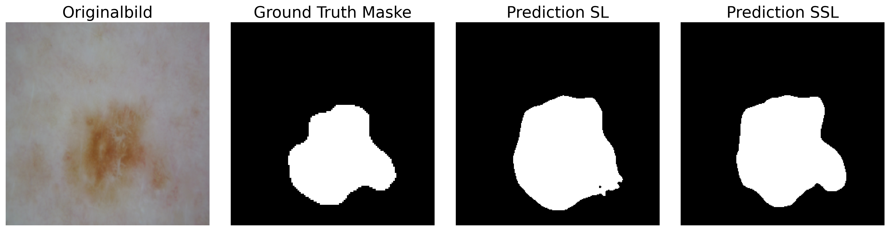
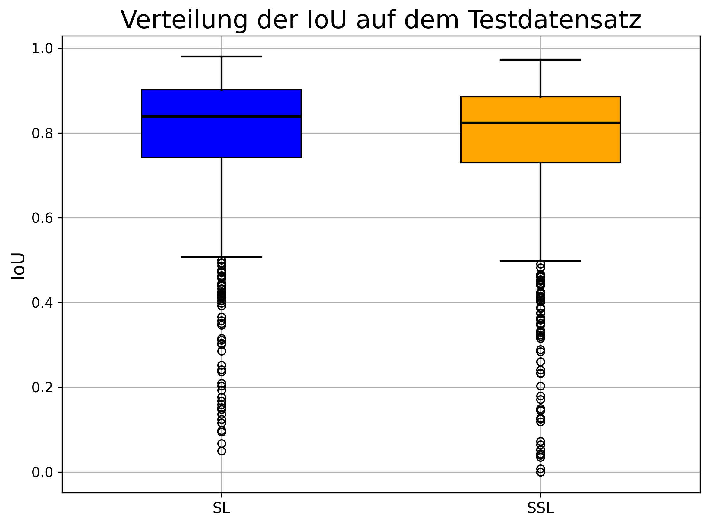

# Semi-Supervised Learning for Dermatological Image Segmentation

## Bachelor Thesis

<p align="center">
  
</p>

This repository contains the implementation, experiments, and evaluation pipeline developed as part of a bachelor thesis focused on supervised and semi-supervised learning for dermatological image segmentation.

The work investigates whether semi-supervised learning methods are capable of achieving competitive segmentation performance while using only a reduced amount of annotated medical image data.

The implementation is based on U-Net architectures with a ResNet34 encoder and includes both a fully supervised baseline as well as a Mean Teacher based semi-supervised learning approach.

---

# Abstract

This project investigates the use of supervised learning and semi-supervised learning for the segmentation of dermatological image data using the ISIC 2018 Challenge dataset. Different segmentation models based on a U-Net architecture with a ResNet34 encoder were implemented and trained. The semi-supervised approach utilizes a Mean Teacher framework and incorporates unlabeled image data during training.

Model performance was evaluated using the Intersection over Union metric. The best supervised model achieved a mean IoU of 0.795 on the test dataset, while the best semi-supervised model achieved a mean IoU of 0.779 despite using only 20% of the labeled training data.

The results demonstrate the potential of semi-supervised learning methods to reduce the dependency on extensively annotated medical image data while still achieving competitive segmentation performance.

---

# Repository Structure

```text
bachelorarbeit_segmentierung/
│
├── data/                  # Dataset handling and preprocessing
├── training/              # Training scripts for SL and SSL
├── testing/               # Evaluation and inference scripts
├── scripts/               # Data loaders and utility scripts
├── runs/                  # Saved checkpoints and training logs
├── results/               # Experimental outputs
├── results_BA/            # Figures and plots used in thesis
├── figures/               # Thesis figures
├── thesis/                # LaTeX thesis files
└── README.md
```

The directories `data/`, `runs/`, and parts of `results/` are not fully included in this repository due to storage limitations. In particular, trained model checkpoints, intermediate experiment outputs, and the complete ISIC datasets were excluded because of their large file sizes.

Only selected figures, evaluation outputs, and scripts required to reproduce the implementation and training pipeline are provided.

---

# Dataset

The experiments are based on:

- **ISIC 2018 Challenge – Task 1: Lesion Boundary Segmentation**

The dataset contains dermoscopic images of skin lesions together with corresponding binary segmentation masks.

Dataset source:
- International Skin Imaging Collaboration (ISIC)
- https://challenge.isic-archive.com/data/

The segmentation masks are binary PNG images:

- Background = 0
- Lesion = 255

The dataset includes multiple lesion types such as:

- Melanoma
- Melanocytic nevi
- Basal cell carcinoma
- Benign keratosis
- Dermatofibroma
- Vascular lesions

---

# Methods

## Supervised Learning

The supervised baseline was trained using:

- U-Net architecture
- ResNet34 encoder
- ImageNet pretrained weights
- Binary Cross Entropy + Dice Loss
- Transfer Learning
- AdamW optimizer

### Training Strategy

The training process consisted of two phases:

1. Frozen encoder training
2. Fine-tuning of the complete network

---

## Semi-Supervised Learning

The semi-supervised approach is based on the:

- Mean Teacher framework

The method uses:

- Labeled training data
- Unlabeled training data
- Teacher-Student consistency training
- Weak and strong augmentations
- Exponential Moving Average teacher updates

Only 20% of the available labeled training data was used for the final SSL experiments.

---

# Model Architecture

Both approaches use:

- U-Net segmentation architecture
- ResNet34 encoder
- Skip connections
- Sigmoid output activation

---

# Results

## Segmentation Performance

| Method | Validation IoU | Test IoU |
|---|---|---|
| Supervised Learning | 0.824 | 0.795 |
| Semi-Supervised Learning | 0.804 | 0.779 |

The results show that the semi-supervised approach achieved competitive segmentation performance despite using only a small fraction of labeled training data.

---

## IoU Distribution

The following boxplot illustrates the IoU distributions of the supervised and semi-supervised models on the ISIC 2018 test dataset.

<p align="center">
  
</p>

The supervised model achieved slightly higher median IoU values and a more compact distribution compared to the semi-supervised approach.

---

# Classification-Based Analysis

An additional classification pipeline was implemented to analyze segmentation performance across lesion categories.

The classification model:

- Uses a ResNet34 backbone
- Was trained on ISIC 2018 Task 3
- Achieved:
  - Accuracy: 0.828
  - Balanced Accuracy: 0.660

The generated pseudo-class labels were used for class-wise segmentation analysis.

---

# Evaluation Metrics

The project uses the following metrics:

- Intersection over Union (IoU)
- Dice Loss
- Accuracy
- Balanced Accuracy

---

# Environment

## Software

| Component | Version |
|---|---|
| Python | 3.12.3 |
| PyTorch | 2.10.0 |
| CUDA | 13.1 |
| Ubuntu | 24.04.4 LTS |
| segmentation_models_pytorch | 0.5.0 |
| Matplotlib | 3.10.8 |

## Development Environment

- Visual Studio Code
- Windows Subsystem for Linux (WSL)
- Ubuntu Linux

---

# Hardware

The experiments were performed using:

- Intel Core i9 (12th Gen)
- 64 GB RAM
- NVIDIA GeForce RTX 3060 (12 GB VRAM)

---

# Installation

## Clone Repository

```bash
git clone <repository-url>
cd bachelorarbeit_segmentierung
```

## Create Virtual Environment

```bash
python -m venv venv
source venv/bin/activate
```

## Install Dependencies

```bash
pip install -r requirements.txt
```

---

# Training

## Supervised Learning

```bash
python -m training.train_supervised
```

## Semi-Supervised Learning

```bash
python -m training.train_mean_teacher
```

---
# Thesis

The complete bachelor thesis associated with this repository discusses:

- Medical image segmentation
- U-Net architectures
- Transfer learning
- Semi-supervised learning
- Mean Teacher training
- Hyperparameter analysis
- Qualitative and quantitative evaluation
- Limitations and future work

---

# Future Work

Possible future improvements include:

- Larger hyperparameter optimization
- Stronger augmentation strategies
- Transformer-based segmentation architectures
- Multi-dataset training
- Pretraining on medical imaging datasets
- Improved pseudo-label filtering strategies
- External validation on independent datasets

---

# License

This repository is intended for academic and research purposes.

The ISIC dataset is distributed under the Creative Commons CC0 1.0 license.

---

# Citation

If you use this repository or parts of the implementation, please cite the associated bachelor thesis.

```bibtex
@misc{fletschinger2026,
  author = {Matti Fletschinger},
  title = {Semi-Supervised Learning for Dermatological Image Segmentation},
  year = {2026}
}
```

---

# Author

Matti Fletschinger  
Bachelor Thesis – Medical and Sports Technology  
MCI Innsbruck